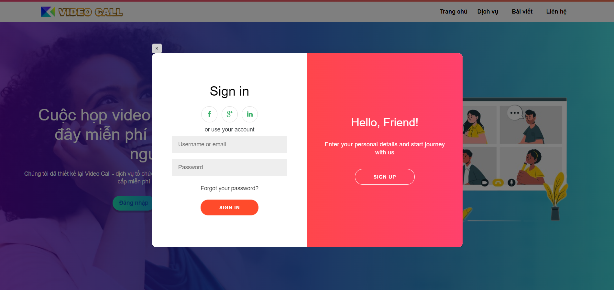
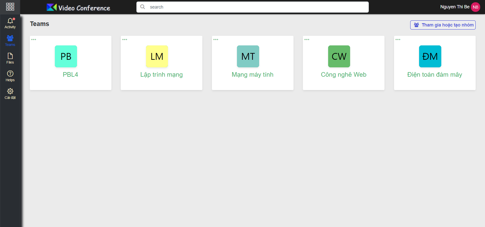
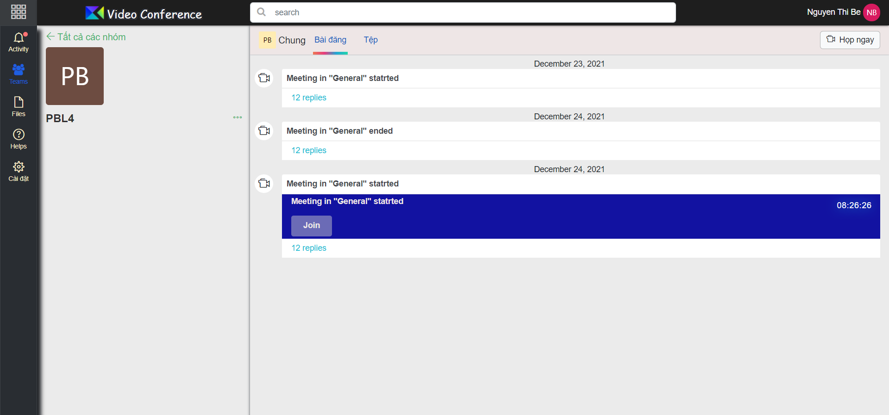
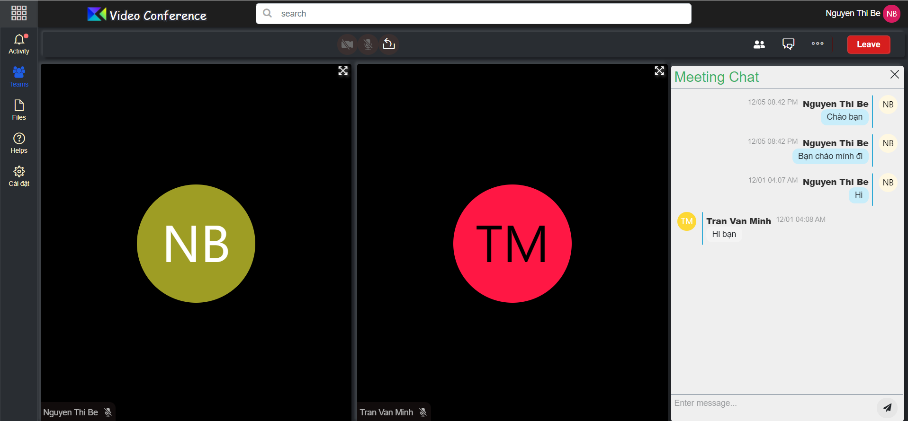

# VIDEO CONFERENCE 

## Introduce
**Video Conference** is a website that allows multiple people to meet and collaborate face to face long distance by transmitting audio, video, text and presentations in real time through the internet.

## Getting Started
Below are the technologies used in the project:
* Backend: Spring Boot
* Frontend: Vuejs
* Database: Mysql
* Deployment: Docker, AWS EC2

**Prerequisites**
You need to install something: 
* Java JDK
* Maven 
* Nodejs
* Vue-CLI
* Docker and docker-compose 

**Installation**
1. Clone the repo
```
git clone https://github.com/LearningForFuture/video-conference.git
```
2. Moving backend module and build jar file
```
cd backend && mvn clean install -DskipTests
```
3. Build images and run containers
```
cd ..
docker-compose build
docker-conpose up
```

## Images
1. Login 

2. Main page

3. Room page

4. Video call page



